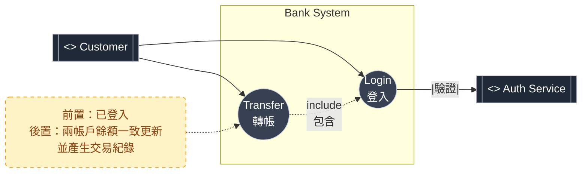

### 106年臺灣銀行新進人員甄試 - 程式設計人員 
### 科目三：程式設計(含安全程式設計) 與科目二：綜合科目

根據公開資源搜索，106年（2017年）臺灣銀行新進人員甄試的程式設計人員（7職等程式設計人員）專業科目（科目三：程式設計）考題的完整官方版本或詳細題目公開資料有限，僅部分共同科目及綜合科目（如邏輯推理、軟體工程等）的試題可取得（如TKB購課網或考友社的考古題下載區）。 考試日期為106/8/26，錄取名額約45名（正取30、備取15）。考試大綱顯示科目三：100分，非選擇題，涵蓋程式設計與安全程式設計（JAVA+SQL 或 .NET C#+SQL）；科目二：50分，非選擇題，含邏輯推理、軟體工程、系統分析、資料結構、資料庫應用。

為協助準備，以下提供基於106年考試大綱及歷年風格（如107-108年公開試題）的**模擬考題與詳解**（科目三總分100分，每題25分；科目二總分50分）。模擬題目強調安全程式設計（如基本驗證、簡單雜湊）、邏輯推理及UML建模，[適用.NET](http://xn--jny749c.net/) C#+SQL。題型參考鼎文公職、阿摩線上測驗及TKBGO題庫。

## 科目三：程式設計(含安全程式設計)（100分，非選擇題）

**題目要求**：[使用.NET](http://xn--2rqz13g.net/) C# + SQL，注重安全（如輸入驗證、參數化）。每題25分。

### **題1：帳戶建立模組（含驗證）【25分】**

設計銀行帳戶建立。資料庫表：

```sql
CREATE TABLE Accounts (
    account_id INT IDENTITY(1,1) PRIMARY KEY,
    account_no VARCHAR(20) NOT NULL UNIQUE,
    owner_name VARCHAR(50) NOT NULL,
    initial_balance DECIMAL(10,2) DEFAULT 0.00,
    created_date DATETIME DEFAULT GETDATE()
);

```

- （一）撰寫SQL插入帳戶（使用參數化，檢查account_no唯一）（8分）。
- （二）在C#中實現`int CreateAccount(string accountNo, string ownerName, decimal initialBalance)`，驗證accountNo（10位數字）、initialBalance ≥0；若重複拋出`AccountExistsException`（12分）。
- （三）說明參數化防SQL注入（5分）。


&nbsp; 
---


### **題2：餘額更新系統【25分】**

設計餘額更新。表：Accounts (account_id INT PK, balance DECIMAL(10,2))。

- （一）SQL更新餘額（加減amount）（8分）。
- （二）C#實現`bool UpdateBalance(int accountId, decimal amount)`，若amount <0檢查餘額，使用Transaction；若不足拋出`OverdraftException`（12分）。
- （三）說明Transaction在更新的角色（5分）。


&nbsp; 
---
### **題3：交易查詢模組【25分】**

設計交易查詢。表：Transactions (trans_id INT PK, account_id INT, amount DECIMAL(10,2), trans_date DATETIME)。

- （一）SQL查詢指定帳戶交易（加索引）（8分）。
- （二）C#實現`List<decimal> QueryTransactions(int accountId, DateTime fromDate)`（12分）。
- （三）說明索引優化（5分）。

&nbsp; 
---
### **題4：簡單加密驗證【25分】**

設計登入驗證，使用簡單雜湊。表：Users (user_id INT PK, username VARCHAR(50), password_hash VARCHAR(32))。

- （一）SQL查詢驗證（8分）。
- （二）C#實現`bool ValidateUser(string username, string password)`，計算MD5比對（12分）。
- （三）說明雜湊安全性（5分）。

&nbsp; 
===

## 科目二：綜合科目（50分，非選擇題）


模擬題型參考106年綜合科目，含(1)邏輯推理（15分）(2)軟體工程（15分）(3)系統分析（10分）(4)資料結構（5分）(5)資料庫應用（5分）。

**(1) 邏輯推理（15分）**

A猜「1357」，B回「1A 1B」；再猜「2468」，B回「0A 2B」。

- （一）第一輪可能底牌總數（6分）。
- （二）結合第二輪，列3示例（5分）。
- （三）猜中機率（4分）。

> 假設底牌為 1–8 的不重複四位數（與兩次猜測一致）。<br>
> A 猜 1357 → 1A1B ⇒ 在 {1,3,5,7} 中恰有 2 個，且其中 1 個在原位、1 個錯位。<br>
> 再猜 2468 → 0A2B ⇒ 在 {2,4,6,8} 中恰有 2 個，且都錯位（各自不在第1~4位對應位>置）。<br>
> （一）第一輪可能底牌總數（只用 1A1B）<br>
> &nbsp;&nbsp; 結論：288 種（1–8 不重複、對 1357 產生 1A1B 的排列數）。<br>
>（二）結合第二輪（兩條件同時成立），示例 3 組<br>
> &nbsp;&nbsp;例：1234、1276、1524（皆滿足 1357→1A1B、2468→0A2B）。<br>
>（三）猜中機率<br>
> &nbsp;&nbsp;綜合兩輪後剩 168 種可能 ⇒ 下一輪隨機一猜中機率 1/168 ≈ 0.6%。

---

**(2) 軟體工程（15分）**

繪UML序列圖給轉帳：User→System→DB。

- （一）文字描述圖（10分）。
- （二）應用於除錯（5分）。


>（一）文字描述圖（10分）<br>
>User→System：Transfer(from,to,amount)（同步呼叫）。<br>
>System：驗證輸入與權限（alt：不合法→回錯）。<br>
>System→DB：BEGIN TRANSACTION。<br>
>System→DB：讀 from 餘額；檢查足額（alt：不足→ROLLBACK→回錯）。<br>
>System→DB：UPDATE Accounts SET balance -= amount WHERE id=from。<br>
>System→DB：UPDATE Accounts SET balance += amount WHERE id=to。<br>
>System→DB：寫交易明細 INSERT Transactions(...)。<br>
>System→DB：COMMIT。<br>
>DB→System：成功；System→User：成功。<br>
（圖上可用 alt 標示「餘額不足」分支，用 activation 表示 System/DB 的生命線與執行區塊）

>（二）用於除錯（5分）<br>
> 序列圖讓你按時間看清每一步呼叫與回傳，能定位：。<br>
> 1.驗證沒擋住的無效輸入；。<br>
> 2.交易開始/提交/回滾是否對齊；。<br>
> 3.併發下更新順序/鎖定是否缺失；。<br>
> 4.失敗分支（alt）是否正確回錯而非半途成功。
---

**(3) 系統分析（10分）**

UML用例圖給銀行系統：登入、轉帳。

- （一）文字描述（6分）。
- （二）Actor關聯（4分）。


>（一）<br>
> 主要 Actor：Customer。<br>
  用例：Login、Transfer。<br>
  Transfer ``<<include>>`` Login（需先登入）。<br>
  前置條件：已驗證身分；後置條件：兩帳戶餘額一致更新且有交易紀錄。


>（二）<br>
> Customer—Login（關聯）。<br>
  Customer—Transfer（關聯）。<br>
 （可註明：Authentication Service/DB 為次要外部系統，作為支援者）
---  

**(4) 資料結構（5分）**

設計堆疊管理交易，push/pop O(1)。

- （一）C#偽碼（3分）。

```cs
class Stack<T> {
    Node top; 
    int n;
    class Node { 
        T v; 
        Node next; 
        public Node(T v, Node next){ 
            this.v=v; this.next=next; 
        } 
    }
    void Push(T x){ 
        top = new Node(x, top); n++; 
    }              // O(1)
  T Pop(){ 
    if(top==null) throw; 
        var x=top.v; 
        top=top.next; 
        n--; 
    return x; } // O(1)
};
```

- （二）應用（2分）。
> 交易系統的Undo/Redo：每次動作 push，回復時 pop 並反向操作 <br>
或：指令處理、括號匹配、回溯。

---

**(5) 資料庫應用（5分）**

GROUP BY查詢交易總額。

- （一）SQL（3分）。
```sql
-- 依帳戶彙總區間內的交易總額
SELECT account_id, SUM(amount) AS total_amount
FROM dbo.Transactions
WHERE trans_date BETWEEN @from AND @to
GROUP BY account_id;
```
- （二）HAVING說明（2分）。