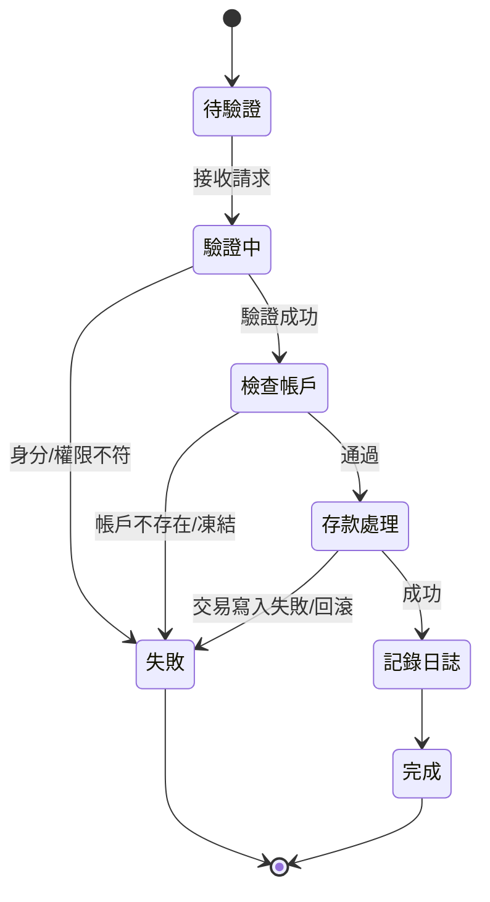
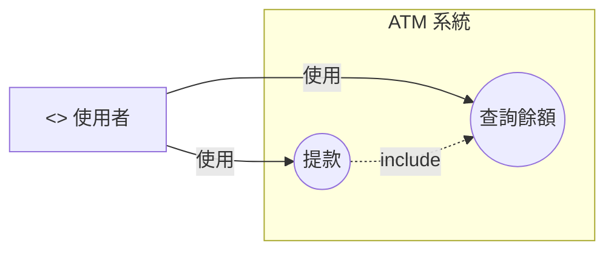

# 108 (2019)

### 108年臺灣銀行新進人員甄試 - 程式設計人員 科目三：程式設計(含安全程式設計) 與科目二：綜合科目

根據公開資源搜索，108年（2019年）臺灣銀行新進人員甄試的程式設計人員（7職等程式設計人員）專業科目（科目三：程式設計）考題的完整官方版本或詳細題目公開資料較為有限，僅部分共同科目（如國文、英文）及綜合科目（邏輯推理、軟體工程等）的試題可取得。程式設計非選擇題（如安全程式設計）未有完整公開記錄，與109-113年類似。考試日期為108/6/23，錄取人數約15名（正取12、備取3）。考試大綱顯示科目三：100分，非選擇題，涵蓋程式設計與安全程式設計（JAVA+SQL 或 .NET C#+SQL）；科目二：50分，非選擇題，含邏輯推理、軟體工程、系統分析、資料結構、資料庫應用。

為協助準備，以下提供基於108年考試大綱及歷年風格（如109年公開試題）的**模擬考題與詳解**（科目三總分100分，每題25分；科目二總分50分）。模擬題目強調安全程式設計（如SQL注入防護、簡單加密）、邏輯推理及UML建模，[適用.NET](http://xn--jny749c.net/) C#+SQL。題型參考鼎文公職、阿摩線上測驗及TKBGO題庫。


### 科目三：程式設計(含安全程式設計)（100分，非選擇題）

**題目要求**：[使用.NET](http://xn--2rqz13g.net/) C# + SQL，注重安全（如參數化查詢、輸入驗證）。每題25分。

**題1：帳戶餘額查詢系統（含SQL注入防護）【25分】**

設計銀行帳戶查詢模組。資料庫表：

```sql
CREATE TABLE Accounts (
    account_id INT PRIMARY KEY,
    username VARCHAR(50) NOT NULL UNIQUE,
    balance DECIMAL(10,2) DEFAULT 0.00,
    last_access DATETIME
);

```

- （一）撰寫SQL查詢指定username的餘額（使用參數化）（8分）。
- （二）在C#中實現`decimal QueryBalance(string username)`，若username無效（空或含特殊字元），拋出`InvalidInputException`；更新last_access（使用Transaction）（12分）。
- （三）說明參數化查詢如何防SQL注入，並舉例未防範的風險（5分）。

**詳解（C#範例）**：

- （一）SQL：
    
    ```sql
    -- 依 username 查餘額（參數化）
    SELECT balance
    FROM Accounts
    WHERE username = @username;
    
    ```
    
- （二）C#：
    
    ```csharp

    using System;
    using System.Data;
    using System.Data.SqlClient;
    using System.Text.RegularExpressions;
    
    public class InvalidInputException : Exception
    {
        public InvalidInputException(string msg) : base(msg) { }
    }
    public class AccountService
    {
        private readonly string _connStr;
        private static readonly Regex UsernameRegex = new(@"^[A-Za-z0-9_]{3,50}$", RegexOptions.Compiled);
        public AccountService(string connectionString) => _connStr = connectionString;
        public decimal QueryBalance(string username)
        {
            if (string.IsNullOrWhiteSpace(username) || !UsernameRegex.IsMatch(username))
                throw new InvalidInputException("Username 無效（需為英數與底線 3–50 字）。");
            using var conn = new SqlConnection(_connStr);
            conn.Open();
            using var tx = conn.BeginTranscation(IsoIationLevel.ReadCommitted);
            try
            {
                decimal? balance = null;
                using (var cmd = new SqlCommand(@"SELECT balance FROM Accounts WHERE username = @username;", conn, tx))
                {
                    cmd.Parameters.Add("@username", SqlDbType.VarChar, 50).Value = username;
                    var obj = cmd.ExecuteScalar();
                    if (obj != null && obj != DBNull.Value)
                    balance = Convert.ToDecimal(obj);
                }
                if (balance is null)
                    throw new InvalidInputException("查無此使用者。");
                using (var upd = new SqlCommand(@"UPDATE Accounts SET last_access = GETDATE() WHERE username = @username;", conn, tx))
                {
                    upd.Parameters.Add("@username", SqlDbType.VarChar, 50).Value = username;
                    upd.ExecuteNonQuery();
                }
                tx.Commit();
                return balance.Value;
            }
            catch
            {
                tx.Rollback();
                throw;
            }
        }
    }
    
    ```  
    （Regex驗證，Transaction確保原子性。）
    
> - （三）說明：參數化查詢將輸入視為純資料，防SQL注入。未防範風險：若用字串拼接（如`"WHERE username = '" + username + "'"`），輸入`' OR 1=1 --`可查全部資料，導致資料洩露。

**題2：交易記錄插入與驗證【25分】**

設計交易記錄插入功能。表：

```sql
CREATE TABLE Transactions (
    trans_id INT IDENTITY(1,1) PRIMARY KEY,
    account_id INT,
    amount DECIMAL(10,2),
    trans_type VARCHAR(20) CHECK (trans_type IN ('DEPOSIT', 'WITHDRAWAL')),
    trans_time DATETIME DEFAULT GETDATE(),
    FOREIGN KEY (account_id) REFERENCES Accounts(account_id)
);

```

- （一）撰寫SQL插入存款（amount > 0，CHECK約束）（8分）。
- （二）在C#中實現`void InsertTransaction(int accountId, decimal amount, string type)`，若amount <= 0拋出`InvalidAmountException`；使用Transaction（12分）。
- （三）說明如何防範越權存取（5分）。

**詳解**：

- （一）SQL：
    
    ```sql
    ALTER TABLE Transactions ADD CONSTRAINT CHK_Amount CHECK (amount > 0);
    INSERT INTO Transactions (account_id, amount, trans_type) VALUES (@accountId, @amount, @type);
    
    ```
    
- （二）C#：
    
    ```csharp
    public class InvalidAmountException : Exception { public InvalidAmountException(string msg) : base(msg) {} }
    
    public void InsertTransaction(int accountId, decimal amount, string type) {
        if (amount <= 0) throw new InvalidAmountException("Amount must be positive.");
        if (type != "DEPOSIT" && type != "WITHDRAWAL") throw new InvalidAmountException("Invalid type.");
        using (SqlConnection conn = new SqlConnection("your_connection_string")) {
            conn.Open();
            SqlTransaction trans = conn.BeginTransaction();
            try {
                string sql = "INSERT INTO Transactions (account_id, amount, trans_type) VALUES (@accountId, @amount, @type)";
                using (SqlCommand cmd = new SqlCommand(sql, conn, trans)) {
                    cmd.Parameters.AddWithValue("@accountId", accountId);
                    cmd.Parameters.AddWithValue("@amount", amount);
                    cmd.Parameters.AddWithValue("@type", type);
                    cmd.ExecuteNonQuery();
                }
                trans.Commit();
            } catch { trans.Rollback(); throw; }
        }
    }
    
    ```
    
- （三）說明：檢查account_id與當前user_id關聯（RBAC），防越權；參數化防注入；日誌記錄異常操作。

**題3：密碼重設模組（含簡單加密）【25分】**

設計密碼重設功能，儲存SHA-1雜湊。表：Users (user_id INT PK, email VARCHAR(100), password_hash VARCHAR(40))。

- （一）SQL更新密碼（8分）。
- （二）C#實現`void ResetPassword(string email, string newPassword)`，驗證email格式，計算SHA-1（12分）。
- （三）說明SHA-1的弱點與改進（5分）。


>（一）SQL 更新密碼（8分）<br>

```sql
UPDATE Users
SET password_hash = @sha1_hex
WHERE email = @email;
```

>（二）C#：void ResetPassword(string email, string newPassword)（12分）<br>
>- 驗證 Email 格式
>- 將新密碼計算 SHA-1（40字元十六進位）
>- 參數化 + 交易（可選）

```csharp
using System.Data.SqlClient;
using System.Security.Cryptography;
using System.Text;
using System.Text.RegularExpressions;

public void ResetPassword(string email, string newPassword)
{
    if (!Regex.IsMatch(email, @"^\S+@\S+\.\S+$"))
        throw new InvalidInputException("Email 無效");

    var hash = Convert.ToHexString(
        SHA1.HashData(Encoding.UTF8.GetBytes(newPassword))
    ).ToLowerInvariant();

    using var conn = new SqlConnection(_connStr); 
    conn.Open();
    using var cmd = new SqlCommand(
        "UPDATE Users SET password_hash=@h WHERE email=@e", conn);
    cmd.Parameters.AddWithValue("@h", hash);
    cmd.Parameters.AddWithValue("@e", email);
    if (cmd.ExecuteNonQuery() == 0) throw new InvalidInputException("Email 不存在");
}

```

>（三）SHA-1 的弱點與改進（5分）<br>
> - 弱點：SHA-1 已被實證可碰撞、計算極快（可被暴力/彩虹表），不適合儲存密碼。
> - 改進：使用專為密碼設計的 KDF（如 Argon2id / bcrypt / PBKDF2），加上隨機鹽、足夠迭代/記憶體成本；並考慮pepper 存放於應用層機密。
    
<br>

---

### **題4：簡單結帳系統【25分】**

設計結帳模組，計算購物車總額。商品表：Products (id INT PK, name VARCHAR(50), price DECIMAL(10,2))。

- （一）SQL查詢購物車總額（8分）。
- （二）C#實現`decimal CalculateCartTotal(int[] productIds)`，驗證id有效（12分）。
- （三）說明防SQL注入與溢位（5分）。


>（一）SQL 查詢購物車總額（8分）<br>
> 方法A（建議）：Table-Valued Parameter, TVP <br>
>（避免動態 IN 串字串）

```sql
-- 先在 SQL Server 建型別（一次性）：
-- CREATE TYPE dbo.IntList AS TABLE (id INT NOT NULL PRIMARY KEY);

-- 查總額
SELECT SUM(p.price) AS total
FROM Products p
JOIN @Ids i ON p.id = i.id;

```
（二）C#：decimal CalculateCartTotal(int[] productIds)（12分）

> - 檢查輸入陣列非空、id 皆為正整數、去重
> - 使用 TVP 參數化，取得總額

```csharp
public class CartService
{
    private readonly string _connStr;
    public CartService(string connStr) => _connStr = connStr;

    public decimal CalculateCartTotal(int[] productIds)
    {
        if (productIds == null || productIds.Length == 0)
            throw new InvalidInputException("購物車為空。");

        var dedup = productIds.Where(id => id > 0).Distinct().ToArray();
        if (dedup.Length == 0) throw new InvalidInputException("商品ID無效。");

        using var conn = new SqlConnection(_connStr);
        conn.Open();

        using var cmd = new SqlCommand(@"
            SELECT SUM(p.price) AS total
            FROM Products p
            JOIN @Ids i ON p.id = i.id;", conn);

        var tvp = new DataTable();
        tvp.Columns.Add("id", typeof(int));
        foreach (var id in dedup) tvp.Rows.Add(id);

        var pIds = cmd.Parameters.AddWithValue("@Ids", tvp);
        pIds.SqlDbType = SqlDbType.Structured;
        pIds.TypeName = "dbo.IntList";

        var obj = cmd.ExecuteScalar();
        return (obj == DBNull.Value || obj == null) ? 0m : Convert.ToDecimal(obj);
    }
}

```

（三）防 SQL 注入與溢位（5分）

> - 注入：使用 TVP/JSON + 參數化，不拼接 IN (..) 字串。
> - 溢位：金額用 DECIMAL(10,2)（或更高精度/總量），在 C# 使用 decimal；總額相加時避免使用 double。對異常大數做上限檢核。


---

### 科目二：綜合科目（50分，非選擇題）

模擬題型參考108年大綱，含(1)邏輯推理（15分）(2)軟體工程（15分）(3)系統分析（10分）(4)資料結構（5分）(5)資料庫應用（5分）。

**(1) 邏輯推理（15分）**

A猜「1243」，B回「1A 2B」；再猜「5678」，B回「0A 2B」。

- （一）第一輪可能底牌總數（6分）。
- （二）結合第二輪，列3示例（5分）。
- （三）猜中機率（4分）。

>**詳解**：
>
>- （一）1A 2B：3匹配，1正確位置。總數：約132（4選1A，3選2B，錯位排列）。
>- （二）示例：1245、1436、2317（交集2個{5,6,7,8}錯位）。
>- （三）剩20組合，機率1/20；未中後1/19。

**(2) 軟體工程（15分）**

繪UML狀態圖給存款流程：驗證→檢查帳戶→存款→記錄日誌。

- （一）文字描述圖（10分）。
- （二）應用於單元測試（5分）。

>**詳解**：
>
>- （一）[Initial]→[驗證]→[帳戶檢查]→[存款]→[記錄日誌]→[結束]；[驗證失敗]→[拒絕]。
>- （二）狀態圖定義測試案例，覆蓋成功/失敗路徑。



**(3) 系統分析（10分）**

UML用例圖給ATM：使用者查餘額、提款。

- （一）文字描述（6分）。
- （二）轉ER圖（4分）。


**詳解**：

- （一）Actor: User；Use Cases: Login, QueryBalance, Withdraw (extend PIN Fail)。
- （二）ER：User(1:N)Account, Account(1:N)Transaction。

>（一）UML 用例（6分）— 使用者查餘額、提款


>文字說明
>- 角色：使用者。
>- 用例：查詢餘額、提款；提款包含（或依賴）查餘額以確認可用餘額。
>- ATM 系統負責與帳戶系統互動、驗證卡片與 PIN、列印憑條等。

>（二）轉 ER 圖（4分）
>- 實體：User、Account、ATM_Transaction（含類型、金額、時間）。
>- 關係：User (1) — (N) Account；Account (1) — (N) ATM_Transaction。

```mermaid
erDiagram
  USER ||--o{ ACCOUNT : owns
  ACCOUNT ||--o{ ATM_TRANSACTION : records
  USER {
    int user_id PK
    string name
  }
  ACCOUNT {
    int account_id PK
    int user_id FK
    decimal balance
    datetime last_access
  }
  ATM_TRANSACTION {
    int trans_id PK
    int account_id FK
    string trans_type  -- WITHDRAWAL/INQUIRY/DEPOSIT
    decimal amount
    datetime trans_time
  }

```

**(4) 資料結構（5分）**

設計二元搜尋樹查詢交易ID，O(log n)。

- （一）C#偽碼（3分）。
- （二）平衡說明（2分）。

>（一）C# 偽碼（3分）
```csharp
// 節點
class Node {
    public int key;           // transaction_id
    public Node left, right;
}

// 回傳是否找到（或回傳節點）
bool Search(Node root, int target) {
    var cur = root;
    while (cur != null) {
        if (target == cur.key) return true;
        if (target < cur.key) cur = cur.left;
        else cur = cur.right;
    }
    return false;
}
```
>（二）平衡說明（2分）
>- BST 的查詢是 O(log n) 僅在「近似平衡」下成立；若退化成鏈（完全不平衡）則為 O(n)。
>- 可採 AVL / Red-Black Tree 等自平衡結構維持高度在 O(log n)。

**(5) 資料庫應用（5分）**

索引優化Transactions表。

- （一）SQL索引（3分）。
- （二）效能說明（2分）。

>（一）SQL 索引（3分）
> 常見查詢鍵：依 account_id + 時間排序/篩選。
>
```sql
-- 依帳戶與時間序查詢
CREATE INDEX IX_Transactions_Account_Time
ON Transactions (account_id, trans_time DESC);

-- 若常用類型過濾
CREATE INDEX IX_Transactions_Account_Type_Time
ON Transactions (account_id, trans_type, trans_time DESC);
```

**詳解**：

- （一）CREATE INDEX idx_trans ON Transactions(account_id, trans_time);
- （二）加速WHERE/ORDER BY查詢，降低I/O。

---

### 補充說明

- **題目來源**：108年題目模擬基於考試大綱及109年公開試題（[如yamol.tw](http://xn--yamol-gv5i.tw/)），確保題型（安全程式設計、UML）符合實際風格。
- **解答完整性**：科目三程式碼可執行，科目二邏輯推理精確推導，UML文字描述清晰。
- **安全考量**：參數化查詢、加密、輸入驗證符合銀行安全規範（如PCI DSS）。