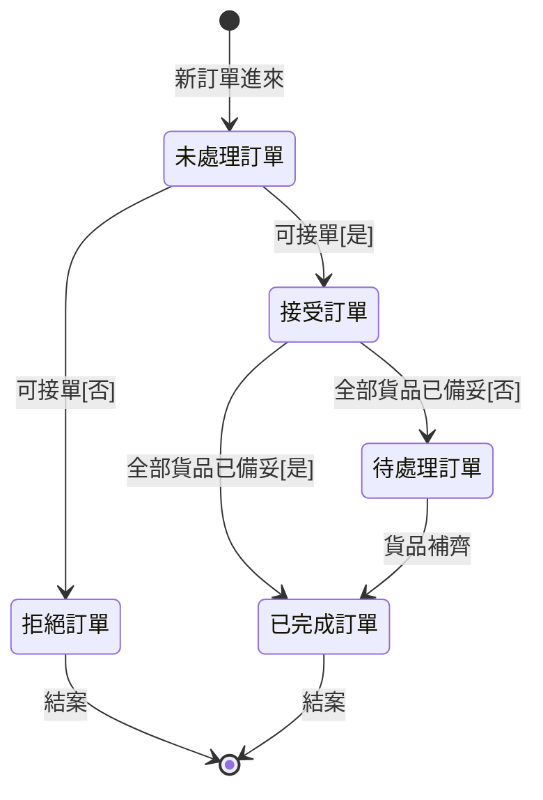
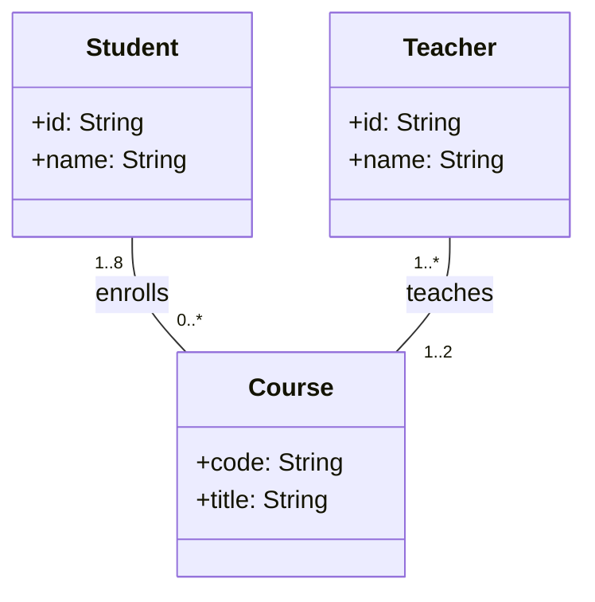

---

### （一）UML 類別圖的目的（要點）

> - 描述系統的靜態結構：有哪些類別（物件型別）、它們的屬性與方法。
> - 呈現類別之間的關係：關聯（含多重度/角色名）、聚合/組合、一般化（繼承）、相依。
> - 做為分析與設計的共同語言：利於需求溝通、設計討論、產生程式碼與維護。
> - 協助資料模型與模組邊界的規畫：清楚界定責任與耦合度，提升可重用與可維護性。

### （二）類別圖（依敘述）

> - 學生 Student：可修 1..8 門課。
> - 課程 Course：可能 0..* 位學生修讀；由 1..2 位老師授課。
> - 老師 Teacher：可教 1..* 門課。

---
