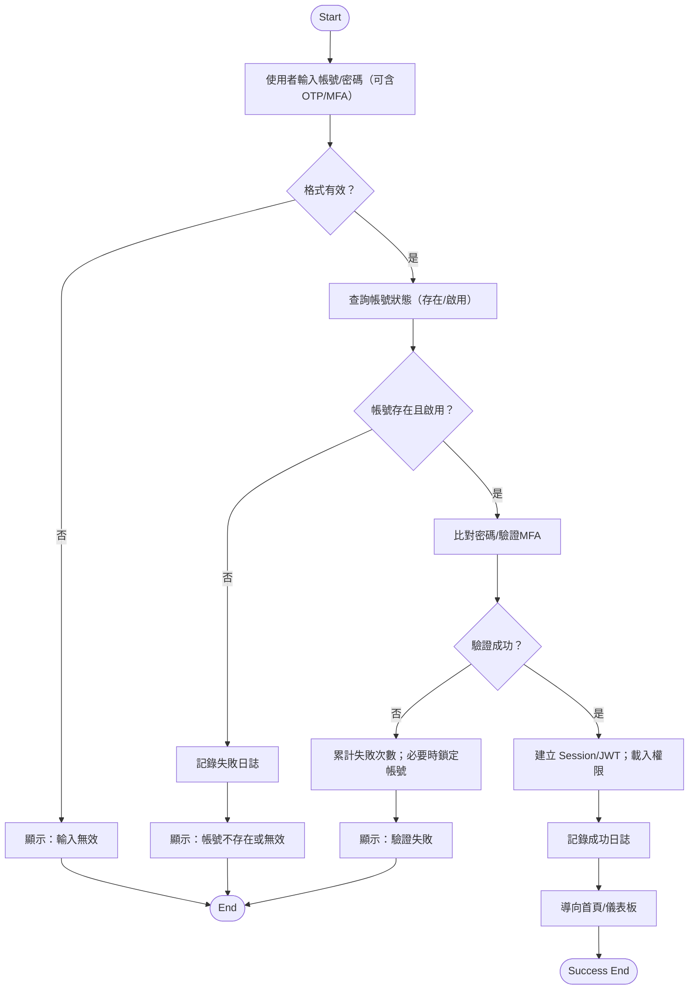
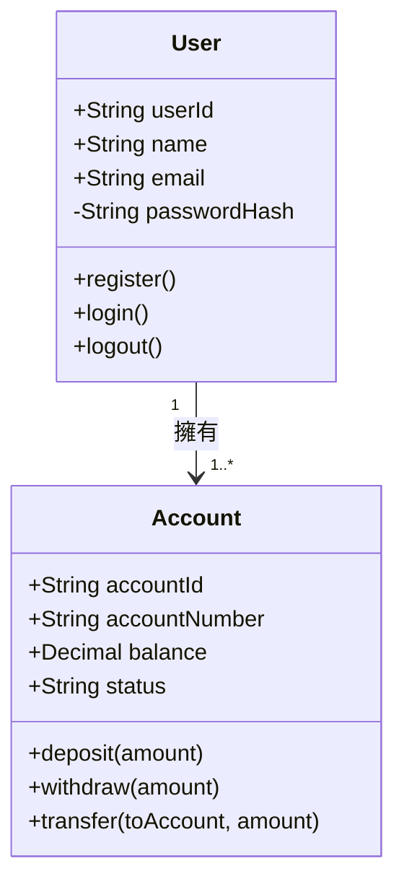
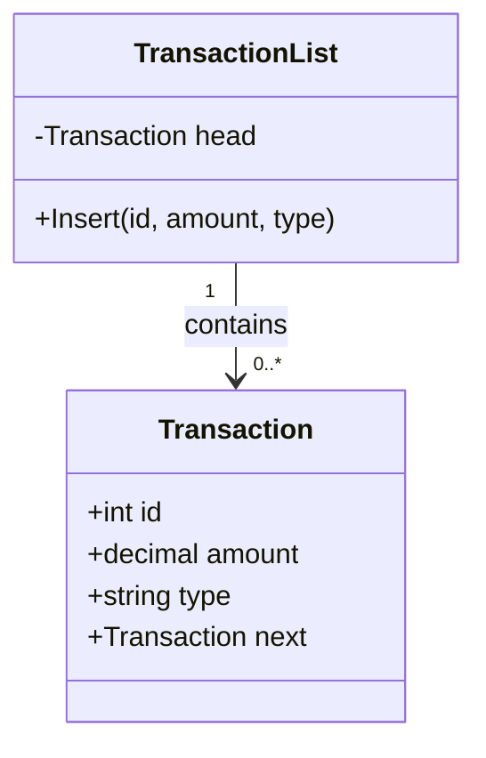

### 107年臺灣銀行新進人員甄試 - 程式設計人員 科目三：程式設計(含安全程式設計) 與科目二：綜合科目

根據公開資源搜索，107年（2018年）臺灣銀行新進人員甄試的程式設計人員（7職等程式設計人員）專業科目（科目三：程式設計）考題的完整官方版本或詳細題目公開資料有限，僅部分綜合科目（如邏輯推理、軟體工程等）的試題可取得（如第二次甄試的綜合科目PDF）。 考試日期為107/4/14（第一次）及107/10/13（第三次），錄取人數約10-15名。考試大綱顯示科目三：100分，非選擇題，涵蓋程式設計與安全程式設計（JAVA+SQL 或 .NET C#+SQL）；科目二：50分，非選擇題，含邏輯推理、軟體工程、系統分析、資料結構、資料庫應用。

為協助準備，以下提供基於107年考試大綱及歷年風格（如108-109年公開試題）的**模擬考題與詳解**（科目三總分100分，每題25分；科目二總分50分）。模擬題目強調安全程式設計（如基本加密、輸入驗證）、邏輯推理及UML建模，[適用.NET](http://xn--jny749c.net/) C#+SQL。題型參考鼎文公職、阿摩線上測驗及TKBGO題庫。

### 科目三：程式設計(含安全程式設計)（100分，非選擇題）

**題目要求**：[使用.NET](http://xn--2rqz13g.net/) C# + SQL，注重安全（如基本雜湊、參數化）。每題25分。

**題1：使用者註冊模組（含輸入驗證）【25分】**

設計銀行使用者註冊。資料庫表：

```sql
CREATE TABLE Users (
    user_id INT IDENTITY(1,1) PRIMARY KEY,
    username VARCHAR(50) NOT NULL UNIQUE,
    password_hash VARCHAR(40) NOT NULL,
    email VARCHAR(100)
);

```

- （一）撰寫SQL插入使用者（使用參數化）（8分）。
- （二）在C#中實現`int RegisterUser(string username, string password, string email)`，驗證username（6-16英數字）、password長度≥8；計算MD5雜湊；若重複拋出`DuplicateUserException`（12分）。
- （三）說明MD5在密碼儲存的風險與防範（5分）。

**詳解（C#範例）**：

- （一）SQL：
    
    ```sql
    INSERT INTO Users (username, password_hash, email) VALUES (@username, @hash, @email); SELECT SCOPE_IDENTITY();
    
    ```
    
- （二）C#：
    
    ```csharp
    using System;
    using System.Data.SqlClient;
    using System.Security.Cryptography;
    using System.Text.RegularExpressions;
    using System.Text;
    
    public class DuplicateUserException : Exception { public DuplicateUserException(string msg) : base(msg) {} }
    
    public int RegisterUser(string username, string password, string email) {
        if (!Regex.IsMatch(username, @"^[a-zA-Z0-9]{6,16}$")) throw new InvalidInputException("Invalid username.");
        if (password.Length < 8) throw new InvalidInputException("Password too short.");
        string hash = BitConverter.ToString(MD5.HashData(Encoding.UTF8.GetBytes(password))).Replace("-", "").ToLower();
        int newId = 0;
        using (SqlConnection conn = new SqlConnection("your_connection_string")) {
            conn.Open();
            string checkSql = "IF EXISTS (SELECT 1 FROM Users WHERE username = @username) RAISERROR('Duplicate', 16, 1)";
            using (SqlCommand checkCmd = new SqlCommand(checkSql, conn)) {
                checkCmd.Parameters.AddWithValue("@username", username);
                try { checkCmd.ExecuteNonQuery(); } catch { throw new DuplicateUserException("Username exists."); }
            }
            string sql = "INSERT INTO Users (username, password_hash, email) VALUES (@username, @hash, @email); SELECT SCOPE_IDENTITY();";
            using (SqlCommand cmd = new SqlCommand(sql, conn)) {
                cmd.Parameters.AddWithValue("@username", username);
                cmd.Parameters.AddWithValue("@hash", hash);
                cmd.Parameters.AddWithValue("@email", email);
                newId = Convert.ToInt32(cmd.ExecuteScalar());
            }
        }
        return newId;
    }
    
    ```
    
    （Regex驗證，MD5雜湊，檢查重複。）
    
- （三）說明：MD5易碰撞與彩虹表攻擊；防範：加鹽（salt）或用SHA-256/bcrypt。

**題2：餘額轉帳系統【25分】**

設計轉帳功能。表：Accounts (account_id INT PK, balance DECIMAL(10,2))。

- （一）SQL轉帳語句（原子性）（8分）。
- （二）C#實現`bool Transfer(int fromId, int toId, decimal amount)`，檢查餘額足夠，使用Transaction；若不足拋出`InsufficientFundsException`（12分）。
- （三）說明Transaction防資料不一致（5分）。

**詳解**：

- （一）SQL：
    
    ```sql
    BEGIN TRANSACTION; UPDATE Accounts SET balance = balance - @amount WHERE account_id = @from; UPDATE Accounts SET balance = balance + @amount WHERE account_id = @to; COMMIT;
    
    ```
    
- （二）C#：
    
    ```csharp
    public class InsufficientFundsException : Exception { public InsufficientFundsException(string msg) : base(msg) {} }
    
    public bool Transfer(int fromId, int toId, decimal amount) {
        if (amount <= 0) throw new InvalidInputException("Invalid amount.");
        using (SqlConnection conn = new SqlConnection("your_connection_string")) {
            conn.Open();
            SqlTransaction trans = conn.BeginTransaction();
            try {
                string checkSql = "SELECT balance FROM Accounts WHERE account_id = @id";
                using (SqlCommand checkCmd = new SqlCommand(checkSql, conn, trans)) {
                    checkCmd.Parameters.AddWithValue("@id", fromId);
                    decimal fromBalance = Convert.ToDecimal(checkCmd.ExecuteScalar());
                    if (fromBalance < amount) throw new InsufficientFundsException("Insufficient funds.");
                }
                string transferSql = "UPDATE Accounts SET balance = balance - @amount WHERE account_id = @from; UPDATE Accounts SET balance = balance + @amount WHERE account_id = @to";
                using (SqlCommand cmd = new SqlCommand(transferSql, conn, trans)) {
                    cmd.Parameters.AddWithValue("@amount", amount);
                    cmd.Parameters.AddWithValue("@from", fromId);
                    cmd.Parameters.AddWithValue("@to", toId);
                    cmd.ExecuteNonQuery();
                }
                trans.Commit();
                return true;
            } catch { trans.Rollback(); return false; }
        }
    }
    
    ```
    
- （三）說明：Transaction確保轉帳原子性，若中途失敗（如扣款成功加款失敗）則回滾，防餘額不一致。

**題3：日誌記錄系統【25分】**

設計操作日誌。表：Logs (log_id INT PK, action VARCHAR(50), timestamp DATETIME, user_id INT)。

- （一）SQL插入日誌（8分）。
- （二）C#實現`void LogAction(int userId, string action)`，使用觸發器記錄（模擬）（12分）。
- （三）說明日誌在審計的安全角色（5分）。

**詳解**：

- （一）SQL：
    
    ```sql
    INSERT INTO Logs (action, timestamp, user_id) VALUES (@action, GETDATE(), @userId);
    
    ```
    
- （二）C#：
    
    ```csharp
    public void LogAction(int userId, string action) {
        using (SqlConnection conn = new SqlConnection("your_connection_string")) {
            conn.Open();
            string sql = "INSERT INTO Logs (action, timestamp, user_id) VALUES (@action, GETDATE(), @userId)";
            using (SqlCommand cmd = new SqlCommand(sql, conn)) {
                cmd.Parameters.AddWithValue("@action", action);
                cmd.Parameters.AddWithValue("@userId", userId);
                cmd.ExecuteNonQuery();
            }
        }
    }
    
    ```
    
- （三）說明：日誌追蹤操作，支援審計與入侵偵測，如查異常轉帳。

**題4：簡單查詢優化【25分】**

優化交易查詢。表：Transactions (trans_id INT PK, account_id INT, amount DECIMAL(10,2), date DATETIME)。

- （一）SQL查詢最近交易（加索引）（8分）。
- （二）C#實現`List<decimal> GetRecentAmounts(int accountId, DateTime since)`（12分）。
- （三）說明索引效能（5分）。

**詳解**：

- （一）SQL：
    
    ```sql
    CREATE INDEX idx_trans ON Transactions(account_id, date); SELECT amount FROM Transactions WHERE account_id = @id AND date >= @since ORDER BY date DESC;
    
    ```
    
- （二）C#：
    
    ```csharp
    using System.Collections.Generic;
    
    public List<decimal> GetRecentAmounts(int accountId, DateTime since) {
        List<decimal> amounts = new List<decimal>();
        using (SqlConnection conn = new SqlConnection("your_connection_string")) {
            conn.Open();
            string sql = "SELECT amount FROM Transactions WHERE account_id = @id AND date >= @since ORDER BY date DESC";
            using (SqlCommand cmd = new SqlCommand(sql, conn)) {
                cmd.Parameters.AddWithValue("@id", accountId);
                cmd.Parameters.AddWithValue("@since", since);
                using (SqlDataReader reader = cmd.ExecuteReader()) {
                    while (reader.Read()) amounts.Add(Convert.ToDecimal(reader["amount"]));
                }
            }
        }
        return amounts;
    }
    
    ```
    
- （三）說明：索引加速WHERE/ORDER BY，降低全表掃描時間，從O(n)到O(log n)。

### 科目二：綜合科目（50分，非選擇題）

模擬題型參考107年綜合科目，含(1)邏輯推理（15分）(2)軟體工程（15分）(3)系統分析（10分）(4)資料結構（5分）(5)資料庫應用（5分）。

**(1) 邏輯推理（15分）**

A猜「2134」，B回「0A 3B」；再猜「5679」，B回「1A 1B」。

- （一）第一輪可能底牌總數（6分）。
- （二）結合第二輪，列3示例（5分）。
- （三）猜中機率（4分）。

> **詳解**：
> - （一）0A 3B：3匹配，全錯位。總數：約144（{2,1,3,4}排列錯位+1新數字）。
> - （二）示例：2145、2316、3417（交集1正確位置1錯位）。
> - （三）剩16組合，機率1/16；未中後1/15。

**(2) 軟體工程（15分）**

繪UML活動圖給登入流程：輸入憑證→驗證→成功/失敗。

- （一）文字描述圖（10分）。
- （二）應用於需求驗證（5分）。


> **詳解**：
> - （一）[開始]→[輸入]→[驗證]→[成功?]→[是]→[登入]→[結束]；[否]→[錯誤]→[結束]。
> - （二）活動圖識別流程分支，驗證需求完整性。


---

**(3) 系統分析（10分）**

UML類別圖給帳戶系統：User、Account。

- （一）文字描述（6分）。
- （二）多重性（4分）。



>（一）文字描述（6分）<br>
> 1. User 類別 <br>
屬性：userId (主鍵)、name、email、passwordHash。<br>
方法：register()、login()、logout()。<br>
說明：代表系統中的使用者，負責帳戶操作的啟動者。<br>
> 2. Account 類別<br>
屬性：accountId (主鍵)、accountNumber、balance、status。<br>
方法：deposit(amount)、withdraw(amount)、transfer(toAccount, amount)。<br>
說明：代表金融帳戶，提供存款、提款、轉帳等功能。<br>
> 3. 關聯<br>
User 與 Account 有「擁有」的關係：一個使用者可以擁有多個帳戶；一個帳戶必須對應到一個使用者。

> (二）多重性（4分）<br>
User → Account：1..* （一個使用者至少有一個帳戶，可以有多個帳戶）。<br>
Account → User：1 （一個帳戶只能對應到一個使用者）。<br>

---

**(4) 資料結構（5分）**

設計鏈結串列儲存交易，插入O(1)。

- （一）C#偽碼（3分）。
- （二）優點（2分）。



（一）C# 偽碼（3分）
我們選擇 單向鏈結串列，在 頭部插入 就能保證 O(1)。
```cs
class Transaction {
    public int id;
    public decimal amount;
    public string type;   // e.g. "deposit" / "withdraw"
    public Transaction next;
}

class TransactionList {
    private Transaction head;

    // O(1) 插入：在頭部插入新交易
    public void Insert(int id, decimal amount, string type) {
        Transaction newTx = new Transaction();
        newTx.id = id;
        newTx.amount = amount;
        newTx.type = type;

        newTx.next = head;
        head = newTx;
    }
}

```

> **詳解**：
> - （一）class Node { decimal amount; Node next; } void Insert(Node head, decimal val) { /* 新節點next=head */ }
> - （二）動態大小，無需移位。

**(5) 資料庫應用（5分）**

JOIN查詢用戶交易。

- （一）SQL（3分）。
- （二）效能（2分）。

（一）SQL（3分）

> **詳解**：<br>
> 假設有兩張表：<br>
Users(user_id, name, email, ...)<br>
Transactions(tx_id, user_id, amount, tx_date, type, ...)<br>
那麼查詢「每位用戶的交易紀錄」可寫成：
```sql
SELECT 
    u.user_id,
    u.name,
    t.tx_id,
    t.amount,
    t.tx_date,
    t.type
FROM Users u
JOIN Transactions t
    ON u.user_id = t.user_id
ORDER BY u.user_id, t.tx_date DESC;

```  
（二）效能（2分）
> 1. 索引（Index）： <br>
在 Transactions.user_id 建立索引（外鍵欄位），能加快 JOIN 與過濾速度。<br>
在 Transactions.tx_date 建立索引，可加速排序或依日期篩選。
> 2. 查詢最佳化： <br>
只選取必要欄位，避免 SELECT *。 <br>
使用 EXPLAIN 分析查詢計劃，確認是否走索引。 <br>
若交易資料量龐大，可考慮 分區表 (Partitioning) 或 批次查詢 提升效能。