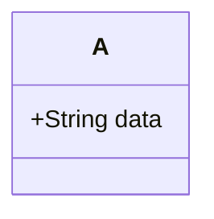
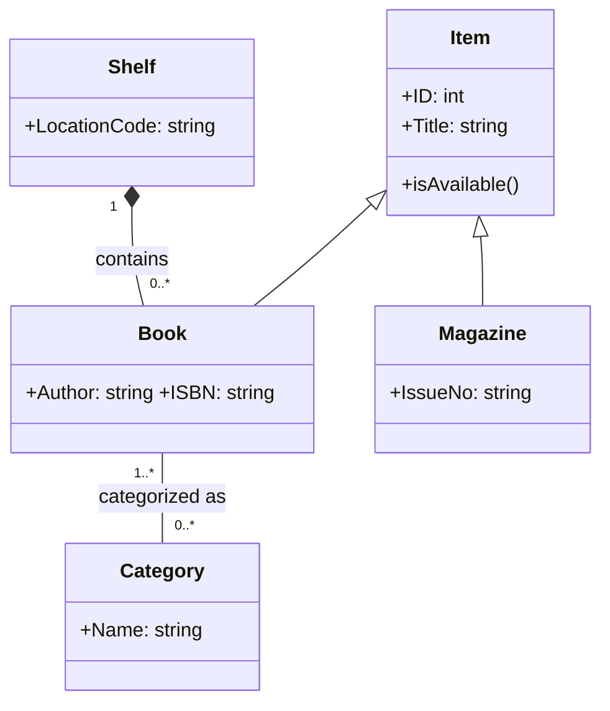



### 科目二 (1)邏輯推理(2)軟體工程(3)程式分析

  <button id="showAll">顯示全部答案</button>
  <button id="hideAll">隱藏全部答案</button>

### 第一題
甲、乙、丙、丁四人參加學校舉辦的拔河賽，比賽結果如下: 
(1)若甲、乙一組，丙、丁為另一組時，雙方勢均力敵，不分勝負: 
(2)若乙、丙一組，甲、丁為另一組時，甲、丁一方能輕易地勝過乙、丙: 
(3)若乙單獨一組可勝過甲、丙一組 
請依上述資料回答下列問題: 
(一)請問這四個人中誰的力氣最大? [5分] 
(二)請依力氣最大到最小列出四個人的順序，並寫出推理過程與答案。 [15分] 

  
顯示答案

 
  下面用「力氣數值」來表示四人的力量：甲=a、乙=b、丙=c、丁=d。拔河取決於兩邊力量總和比較。

已知：

1. 甲+乙 與 丙+丁 勢均力敵 ⇒ a + b = c + d …(I)
2. 乙+丙 對 甲+丁，甲+丁輕易獲勝 ⇒ a + d > b + c …(II)
3. 乙 單挑 甲+丙，乙獲勝 ⇒ b > a + c …(III)

解題
(II) 利用 (I) 消去 d：由 (I) 得 d = a + b − c。代入 (II)：
a + (a + b − c) > b + c
⇔ 2a + b − c > b + c
⇔ 2a > 2c
⇔ a > c …(A)
由 (I) 得 d = a + b − c。又因 (A) 知 a > c，故 a − c > 0，
⇒ d = b + (a − c) > b …(B)
再由 (III) 知 b > a，且 b > c。綜合 (B) 與 (III)：
d > b > a > c

作答

(一) 力氣最大者：丁。 
(二) 由大到小之順序：丁 ＞ 乙 ＞ 甲 ＞ 丙。推理如上：(I)(II) 推得 a>c，再由 d=a+b−c 得 d>b；配合 (III) 的 b>a、b>c，故整體序為 d>b>a>c。

### 第二題
20個小朋友進行一個活動，從1到20號照順序排列。從1號開始説「剪刀」或「石頭」或「布」。 
活動規則為弱上一個人說剪刀，下一個人只能說「石頭」；若接在說「石頭」後面的人，只能說「石頭」或者「布」; 
而若前一個人說「布」，下一個人只能說「剪刀」。 
請回答下列問題 : 
(一)若1號小朋友說「布」，從1號到20號活動進行一遍後，「布」被說出的次數最少是幾次?(請寫出推理過程，否則不予計分)[8分] 
(二)若1號小朋友說「剪刀」，從1號到20號活動進行一遍後，「剪刀」被說出的次數最多是幾次?(請寫出推理過程，否則不予計分)[12分] 

  
顯示答案

先把規則寫成「狀態轉移」方便推理：
說「剪刀」→ 下一個人只能說「石頭」
說「布」→ 下一個人只能說「剪刀」
說「石頭」→ 下一個人可以說「石頭」或「布」

(一) 1 號說「布」→ 一輪後「布」最少幾次？
1 號「布」→ 2 號必「剪刀」→ 3 號必「石頭」。
之後只要每逢輪到「石頭」時都不選「布」、一直選「石頭」，就永遠不會再觸發「布」。

範例極小次數序列（20 人）：
1布，2剪刀，3石頭，4石頭，…，20石頭
「布」出現次數：只有第 1 人那一次 ⇒ 1 次（最少）
答案（1）：1 次

(二) 1 號說「剪刀」→ 一輪後「剪刀」最多幾次？
要得到「剪刀」，前一個人必須說「布」（因為「布」→下一個只能「剪刀」）。
而「布」只有在前一個是「石頭」時才可被選出。再者，任一個「剪刀」之後下一個必是「石頭」。
因此，從某個「石頭」開始，每造一次「石頭→布→剪刀→石頭」的三步循環，就能多製造 1 次「剪刀」，並回到「石頭」準備下一輪。這個循環長度固定為 3 人。

- 起點：1 號已是「剪刀」，2 號必是「石頭」。
- 從第 3 人起到第 20 人，還有 18 個位置，可塞入最多 18 ÷ 3 = 6 個三步循環。
- 每個循環貢獻 1 次「剪刀」，再加上第 1 人原本的「剪刀」1 次，合計 6 + 1 = 7 次。
- 可達成的範例極大序列（讓最後一位也說到剪刀）：
1剪刀，2石頭，3石頭，4布，5剪刀，6石頭，7布，8剪刀，9石頭，
10布，11剪刀，12石頭，13布，14剪刀，15石頭，16布，17剪刀，18石頭，19布，20剪刀
（統計「剪刀」在 1、5、8、11、14、17、20 共 7 次）

答案（2）：7 次

### 第三題
軟體流程模型(Software Process Models)包含，瀑布式模型(Waterfall Model)與漸增式開發(Incremental Development)等不同種類的模型，其中瀑布式模型是一種傳統的軟體流程模型，包含數個循序漸進的基本活動，最後會進入系統的「上線操作與維護(Operation and Maintenance)」階段。請回答下列問題 : 
(一)請列出並說明瀑布式模型「上線操作與維護」之前的四個基本活動內容。[6分] 
(二)請解釋漸進式開發的核心概念，並指出其與瀑布式模型在流程上的主要差異。[5分] 
(三)漸進式開發有多項主要優點，請說明其中任兩項。[4分] 

  
顯示答案

### (一) 瀑布式模型「上線操作與維護」之前的四個基本活動
1. 需求分析與規格（Requirements/Specification）
蒐集利害關係人需求，澄清範圍與限制，形成可驗證的需求規格書（功能/非功能、介面、資料等）。
2. 系統與軟體設計（System & Software Design）
進行架構設計（模組切分、介面、資料庫、通訊）、詳細設計（演算法、資料結構、類別/API）以滿足規格。
3. 實作與單元測試（Implementation & Unit Testing）
依詳細設計撰寫程式碼，對各模組/類別進行單元測試，確保基本功能正確與內部品質（邏輯、邊界條件）。
4. 整合與系統測試（Integration & System Testing）
逐步整合模組，執行整合測試、系統/效能/安全/相容性測試，驗證系統符合需求規格並準備交付。
之後才進入：上線操作與維護（Operation & Maintenance）。

---

(二) 漸進式開發的核心概念與與瀑布式差異
核心概念：
- 把需求分成多個「可交付增量（increment）」，每個增量都經歷需求→設計→實作→測試→可運作交付。
- 透過短週期反覆與使用者回饋，逐步擴充系統功能並修正需求。
與瀑布式的主要差異：
- 流程節奏： 瀑布式是一次性、順序完成再交付；漸進式是多次、小批量完成並多次交付。
- 需求處理： 瀑布式傾向前期凍結需求；漸進式容許需求演進、每次迭代校正方向。
- 風險/回饋： 瀑布式回饋晚、風險後置；漸進式早期可見成果、風險分散且可快速調整。

---

(三) 漸進式開發的兩項主要優點（任兩項即可
- 更早交付價值：先完成高優先功能，縮短上市時間（time-to-value）。
- 降低風險：把大專案切小塊，問題早暴露、影響面小。
- 需求貼近實際：每次交付都有使用者回饋，成品更符合需求。
- 更易測試與品質控管：每個增量範圍小、可控性高。

### 第四題
在軟體生命週期(SDLC)的開發與維護階段，版本控制(Version Control)工具通常扮演重要角色。請回答下列問題: 
(一)簡要說明版本控制對軟體開發的重要性，並列舉兩個知名的雲端版本控制服務。[5分] 
(二)請舉出兩個版本控制系統能提供的功能，並說明這些功能如何幫助開發團隊。[5分] 
(三)請簡要說明版本控制在DevOps流程中的重要性，並舉一個例子說明。[5分] 

  
顯示答案

### (一) 為何重要？+ 雲端服務例子 [5分]
- 重要性（摘述）
作為單一真相來源（Single Source of Truth）：集中管理每次修改，保留完整歷史與責任歸屬。
協作與並行開發：多人可同時開發不同功能/修 bug，透過分支與合併控制變更。
可追溯/可回復：出錯能快速比較差異、回滾版本；版本標記便於發版管理。
自動化基礎：變更即事件，能觸發測試、建置、部署。
- 雲端版本控制服務（任列二）
GitHub、GitLab、Bitbucket、Azure Repos（任選其二即可）

---

### (二) 版本控制系統提供的功能與幫助（舉二項說明）[5分]
- 分支（Branching）與合併（Merging）
幫助：功能開發、修補與試驗在各自分支進行，互不干擾；完成後合併回主線，降低衝突與風險。
- 拉取請求/合併請求（PR/MR）與程式碼審查
幫助：在合併前進行同儕審查、跑自動測試與靜態掃描，提升品質並建立審計軌跡。
- 版本標記（Tag/Release）、差異/歷史追蹤（Diff/Log/Blame）、存取權限與保護分支、鉤子/Hooks 觸發自動化。
  
---

### (三) 在 DevOps 流程中的重要性 + 範例
重要性：版本控制是 DevOps 的管道入口與可追溯中樞。所有基礎設施即程式（IaC）、應用程式碼、組態都進入 VCS；每次提交（commit）成為可觀測、可審核、可復原的變更單位，同時觸發 CI/CD 自動化測試、建置、部署，落實小步快跑與持續交付。

- 範例：
開發者對 feature/payment 分支提交 → 自動觸發 CI 跑單元/整合測試與安全掃描 → 發 PR/MR，通過審查與管控規則（如覆蓋率門檻）後合併到 main → CD 管線自動建置映像、套用 Terraform/Kubernetes 到Staging，驗收通過再「一鍵/自動」推到Production；若發現問題，以 VCS 標記的上一版 v1.2.3 立即回滾。

### 第五題
有關物件導向系統分析與設計之基本概念，請依下列問題分別說明其核心觀念與原則: 
(一)何謂類別(Class)與物件(Object)？請加以定義，並舉例說明兩者之關係。[4分] 
(二)何謂UML類別圖(Class Diagram)?其於系統設計中具備何種功能與角色?[5分] 
(三)何謂「高內聚(High Cohesion)、低耦合(Low Coupling)」？此原則為何被視為良好的系統設計準則？[6分] 

  
顯示答案

### (一) 類別（Class）與物件（Object）是什麼？關係為何？
- 類別：一種「藍圖/模板」，定義一群物件共有的屬性（state）與方法（behavior）。
例：Class Account { balance, owner; deposit(); withdraw(); }
- 物件：依類別「實例化」後得到的個體，有身分（identity）、狀態（屬性值）與行為（可呼叫的方法）。
例：Account#A001（owner=Vince, balance=1000）、Account#A002（owner=Mary, balance=500）。
- 關係：類別→可產生多個物件；物件共享類別定義的行為，但各自持有不同狀態。類別是抽象、物件是具體。

---

### (二) 什麼是 UML 類別圖？在設計中的功能與角色？
- 定義：UML 類別圖是描述系統靜態結構的圖，顯示類別、屬性、操作（方法）以及類別間的關係。
常見關係：關聯（含多重性 1、0..1、1..*）、聚合（空心菱形）、組合（實心菱形）、繼承/泛化（空心三角）、實作、相依等。

- 功能/角色：
1. 領域建模：把問題領域概念化為類別與關係。
2. 設計溝通：團隊對齊資料結構與模組邊界（API/介面）。
3. 開發依據：作為程式骨架/資料庫結構的依循（有時可自動產生程式碼/ERD）。
4. 可追溯性：需求→設計→實作的對應更清楚。

---

### (三) 何謂「高內聚、低耦合」？為何是良好準則？

- 高內聚（High Cohesion）：模組/類別專注於單一職責與密切相關的功能；內部元素彼此關聯度高。 
> 例：PaymentService 只處理付款流程，不混入寄信、報表。
- 低耦合（Low Coupling）：模組間相依最小、介面清楚，一個模組的變更不致波及他模組。
> 例：PaymentService 依賴 INotifier 介面而非具體 EmailNotifier（以介面與相依反轉/DI降低耦合）。
- 為何好：
> 1. 可維護/易修改：變更影響面小。
> 2. 可重用/可測試：職責單純，單元測試容易。
> 3. 可擴充：透過替換實作（策略/多型）擴充行為。
> 4. 品質與穩定度提高：錯誤更易定位、復用更安全。
> 實務對應：SRP（單一職責）、ISP（介面隔離）、DIP（相依反轉）、封裝/資訊隱藏、事件/觀察者解耦等，都是實現高內聚低耦合的常見手段。

### 第六題
請依下列敘述，繪製一張UML類別圖(Class Diagram)，圖中應明確呈現物件導向的繼承(generalization)、關聯(association)與組合(composition)等關係: 
(一)某「圖書館管理系統」中，存在一個抽象類別Item，代表所有可借閱的館藏項目，包含屬性:ID、Title、IsAvailabled()方法。Item被兩個具體子類別繼承:Book(書籍)與Magazine(雜誌)，Book額外包含屬性Author、ISBN、Magazine則包含屬性IssueNo。[7分] 
(二)每一本書可屬於一項或多項「書籍分類(Category)」，書籍分類具有Name屬性，且每一項分類可包含多本書。[4分] 
(三)Book 也被納入「書架(Shelf)」管理，一個書架可包含多本書，但一本書只屬於一個書架。Shelf包含屬性LocationCode。[4分] 





顯示答案

下面給一張 UML 類別圖（Mermaid），並在圖下補充多重性說明，涵蓋繼承、關聯、與組合三種關係。





> 多重性重點：
> - Book ↔ Category（關聯）：
> 每本書屬於 1..* 個分類；每個分類可含 0..* 本書（多對多）。
> - Shelf ▣ Book（組合）：
> 一個書架可包含 0..* 本書；每本書只屬於 1 個書架（強擁有）。
> - 繼承（一般化）：Book、Magazine 繼承抽象 Item。

